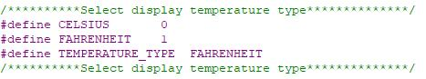
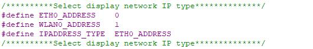
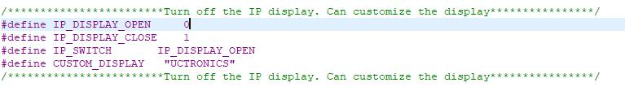

# pp4-skadi


**Skadi** is the internal playground server for my homelab, hosted on a Raspberry Pi 4.

## 📁 Repo Structure

```text
pp4-skadi/
├── .github/workflows/      # CI for YAML validation
├── backup_logs/            # Oldest logs from update script
├── dockprom/               # Docker container(s) for Prometheus Node Exporter for RPi
├── images/                 # Images for README files
├── logs/                   # Most recent update script logs
├── scripts/                # Auto-Updater script for RPi (can be associated with cronjob)
├── U6143_ssd1306/          # Python, C code, and script for UCTronics display screen
└── README.md               # You're reading it!
```

---

## 🧰 Services
- Testing docker container configs for RPi's

- Developing documentation on other RPi setups currently in my homelab.
  - This allows me to develop proper documentation for existing RPis without taking down my current services

- Current RPi Services in production
  - Odin
    - **Pi-hole**: Blocks ads, trackers, and telemetry across the network.
    - **Dockprom**: Collects Docker and system metrics for monitoring and analysis.
  - Mimir
    - **Grafana**: Visualizes metrics and analytics through customizable dashboards.
    - **Dockprom**: Collects Docker and system metrics for monitoring and analysis.
    - **UniFi Controller**: Manages UniFi network devices and monitors network performance.
    - **Uptime Kuma**: Monitors website and service uptime with alerts on failures.
    - **Ookla Internet SpeedTest**: Measures and logs internet connection speed and latency.
    - **Static-Site Generator (NGinx)**: Serves pre-built static websites via a lightweight web server.
  - Loki
    - **Transmission Server**: Manages and downloads torrents with a web interface.
    - **Dockprom**: Collects Docker and system metrics for monitoring and analysis.

---

## 🖥️ Installing U6143_ssd1306 Display

- Preparation

  - Install GIT (app used to download this repo onto your device)
```bash
sudo apt install git -y
```

  - Download repo
```bash
cd
git clone https://github.com/OnyxJeff/pp1-odin.git
```

```bash
sudo raspi-config
```
Choose Interface Options Enable i2c

- Run setup_display_service.sh script
```bash
cd ~/pp4-skadi/U6143_ssd1306
chmod +x setup_display_service.sh
sudo ./setup_display_service.sh
```

- Custom display temperature type
  - Open the U6143_ssd1306/C/ssd1306_i2c.h file. You can modify the value of the TEMPERATURE_TYPE variable to change the type of temperature displayed. (The default is Fahrenheit)
  

- Custom display IPADDRESS_TYPE type
  - Open the U6143_ssd1306/C/ssd1306_i2c.h file. You can modify the value of the IPADDRESS_TYPE variable to change the type of IP displayed. (The default is ETH0)
  

- Custom display information
  - Open the U6143_ssd1306/C/ssd1306_i2c.h file. You can modify the value of the IP_SWITCH variable to determine whether to display the IP address or custom information. (The custom IP address is displayed by default)
  

Note: I did rewrite the initial install script to be more repo friendly.

---

## 📦 Installing Docker Compose

- Update and Upgrade the System:
```bash
sudo apt update
sudo apt upgrade -y
```

- Install Docker
```bash
cd
curl -fsSL https://get.docker.com -o get-docker.sh
sudo sh get-docker.sh
```

- Add User to Docker Group
```bash
sudo usermod -aG docker $USER
```

  - After running this command you will need to log out and log back in (or I recommend just rebooting) for the changes to take effect.

- Install Docker Compose:
```bash
sudo apt install docker-compose-plugin
```

- Verify Installation:
```bash
docker run hello-world
docker compose version
```

### Installing your first container(s)

- Installing Dockprom (Prometheus Exporter)
```bash
cd ~/pp4-skadi/dockprom
docker compose up -d
```

---

## Acknowledgements

This project uses or is inspired by the following repositories:

- [U6143_ssd1306](https://github.com/UCTRONICS/U6143_ssd1306) – Provides the C display code used in the systemd service setup.
- [Dockprom](https://github.com/stefanprodan/dockprom) – Used for Docker-based Prometheus monitoring and metrics collection.

---

📬 Maintained By
Jeff M. • [@OnyxJeff](https://www.github.com/onyxjeff)